# edicrowds-frontend
This repository contains the frontend for the Edinburgh Crowds project.

Edinburgh Crowds will provide a web-based nowcast of pedestrian density in Edinburgh.
Edinburgh Crowds is a dual-use project; it exists both to act as an open-source porfolio and (hopefully) a minor income source for Tristan Goss.

## Tools & Technologies used

- This project was bootstrapped with [Vite](https://vitejs.dev/), using the React + TypeScript template.
- Linting on pre-commit hooks via Husky, including for 100% type coverage
- Frontend Hosted on Vercel
- Domain management via names.co.uk
- Email forwarding via ImprovMX
- Mailing list via Google Forms
- Background maps via MapTiler, MapLibre and OpenStreetMap
- Observation Area tiles served via Postgres and Tegola, both hosted on OVHCloud
- Data preparation and processing using OpenStreetMap and Geopandas
- Nowcast engine implemented using FastAPI 
- Webscrapers implemented using FastAPI and BeautifulSoup 
- GDPR-compliant web analytics using Umami Cloud
- Buymeacoffee for micro-donations

## Edinburgh Crowds Architecture

```mermaid
graph TD

    DataSource1[/Data Source 1/] --> WebScraper1
    DataSource2[/Data Source 2/] --> WebScraper2
    CensusOAs[/National Census Observation Areas/] --> ManualProcessing[Manual Preparation]
    OpenStreetMap[/OpenStreetMap Overpass API/] --> ManualProcessing[Manual Preparation]
    ManualProcessing[Manual Processing] -->|Augmented OAs| PostGIS

    subgraph OVHCloud
        WebScraper1[Web Scraper 1] -->|Standardised Measurements| Engine
        WebScraper2[Web Scraper 2] -->|Standardised Measurements| Engine
        PostGIS --> Tegola
        Tegola -->|Vector Tiles| nginx
        Engine <--> PostGIS
        Engine[FastAPI Nowcast Engine] -->|pedestrian densities| nginx
    end

    subgraph Vercel
        nginx --> ReactSPA[React SPA]
    end

    ReactSPA --> User([User])

    classDef manual fill:#fff,stroke:#000,stroke-dasharray: 5 5;
    class ManualProcessing manual;
```


## Getting Started

### Install dependencies
```bash
npm install
```

### Pre-commit Hook (Husky)
This project uses [Husky](https://typicode.github.io/husky) to run type and lint checks automatically before each commit. Husky should be automatically setup as a side-effect of running `npm install`.

#### How it works
When you commit changes (using `git commit`), Husky runs:

```bash
npm run precommit
```
This runs:
- ESLint (`npm run lint`)
- TypeScript Strict Checking (`npm run typecheck`)
- Type Coverage CHecking (`npm run typecoverage`)
- Type Pruning Checks (`npm run prune`)

### Start the Development Server
```bash
npm run dev
```
This will start the app at http://localhost:5173.

### Build for Production
```bash
npm run build
```
The production-ready output will be in the `dist/` folder.

### Preview the production build
```bash
npm run preview
```

### Project Structure
```bash
├── public/             # Static assets
├── src/                # Source code
│   ├── assets/         # Images, fonts, etc.
│   ├── App.tsx         # Root component
│   └── main.tsx        # Entry point
├── index.html          # HTML template
├── tsconfig.json       # TypeScript config
└── vite.config.ts      # Vite config
```

### Learn More
- [Vite Documentation](https://vitejs.dev/)
- [React Documentation](https://react.dev/)
- [TypeScript Documentation](https://www.typescriptlang.org/)
